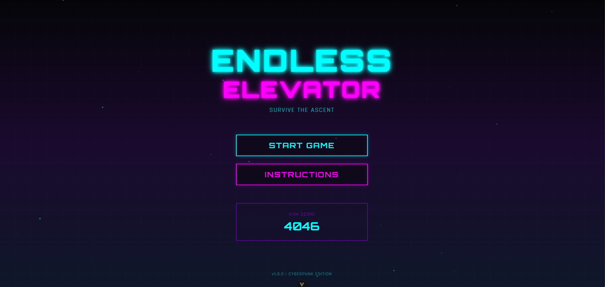
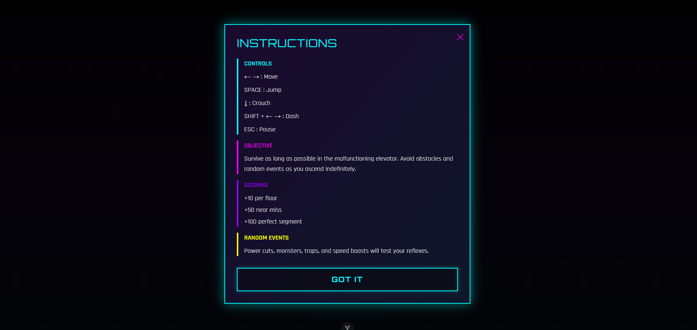
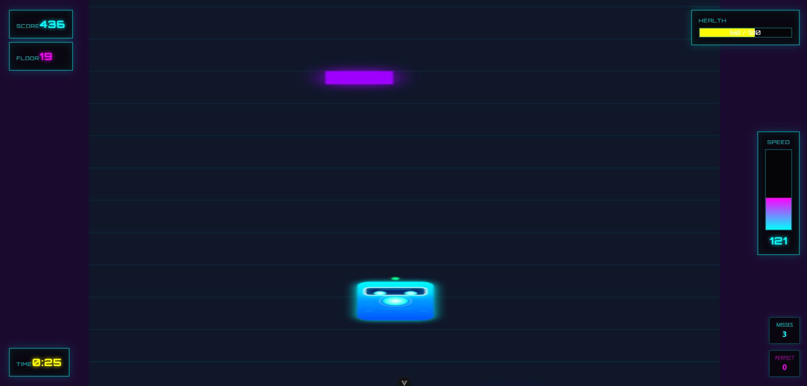

# Endless Elevator

Endless Elevator is a 2D vertical endless-runner / survival game where the player controls a character inside a malfunctioning elevator cabin that ascends indefinitely through a procedurally generated shaft. The goal is to survive as long as possible while avoiding dynamically spawned hazards and events.

### 📷 **ScreenShots**

   
   
   
   
